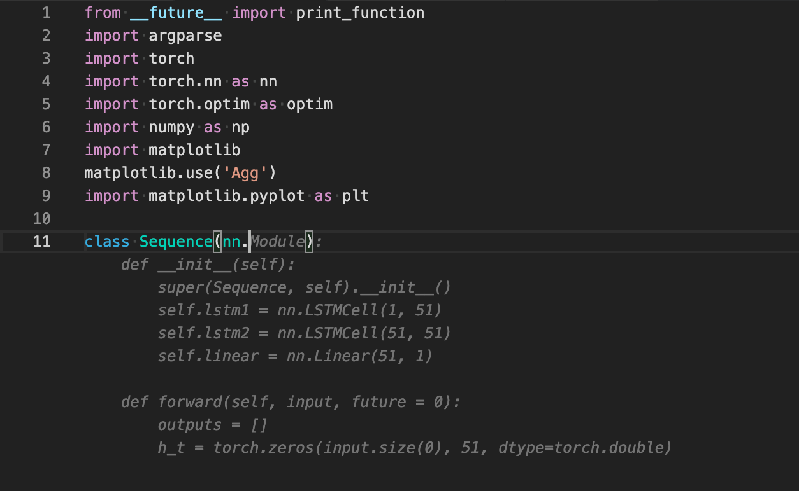
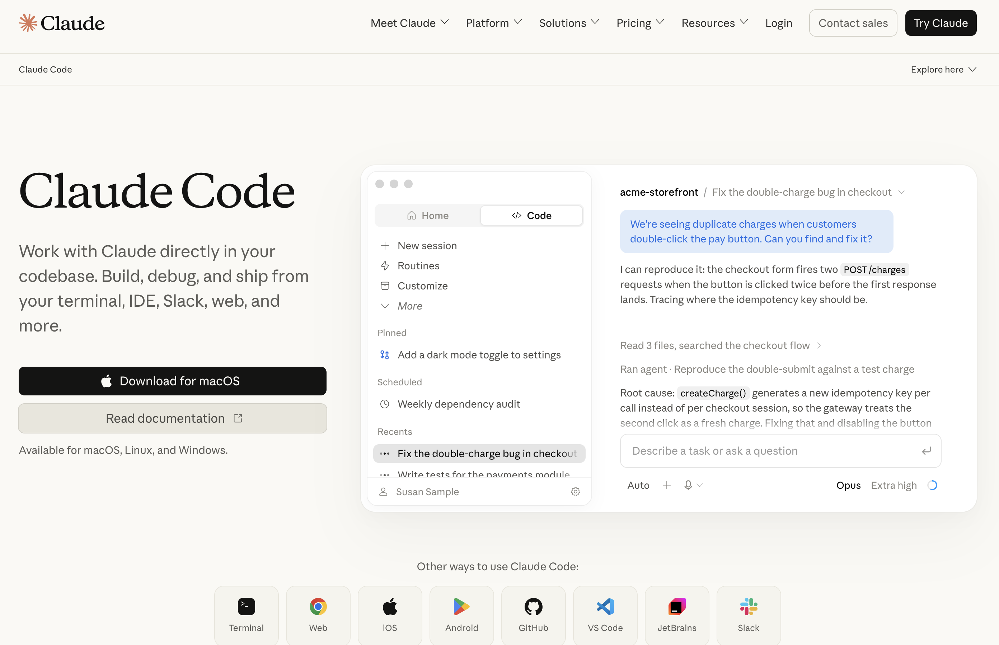
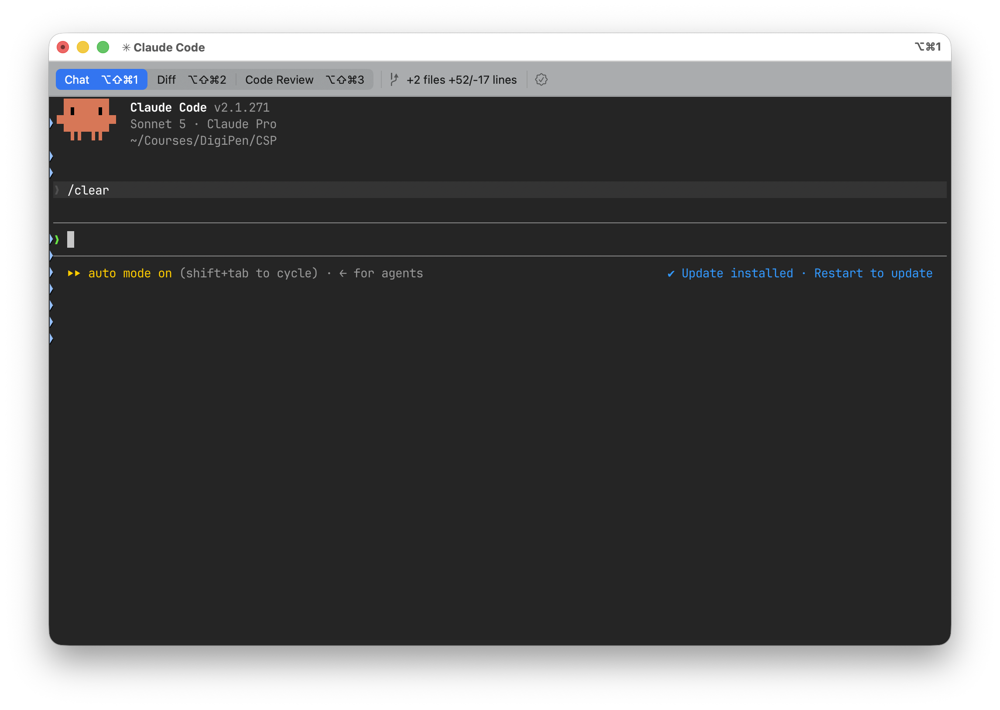
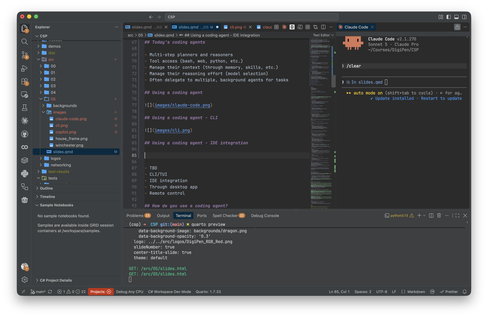
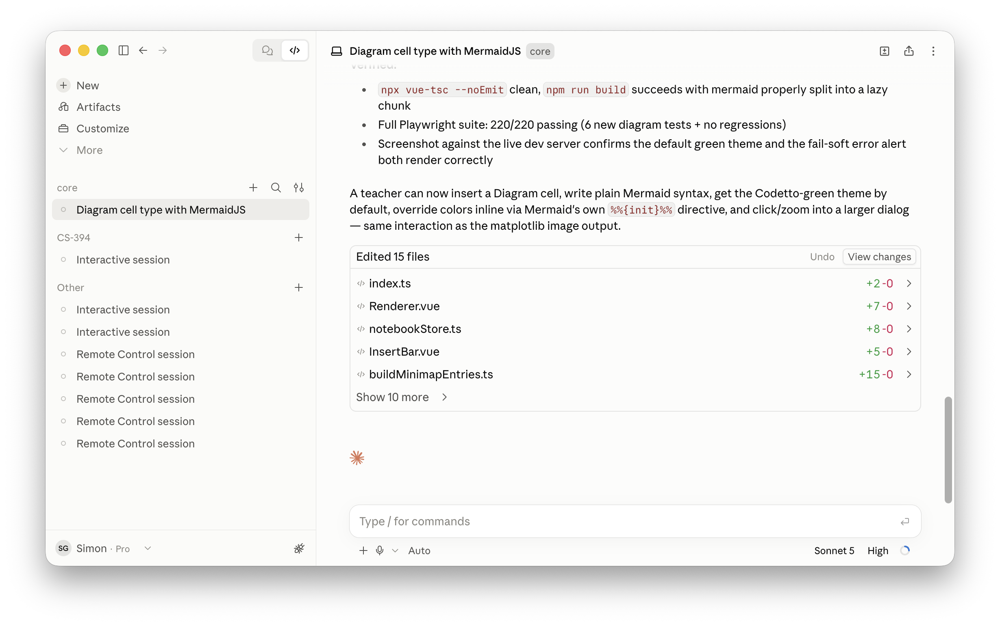
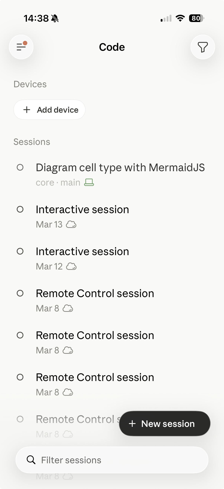
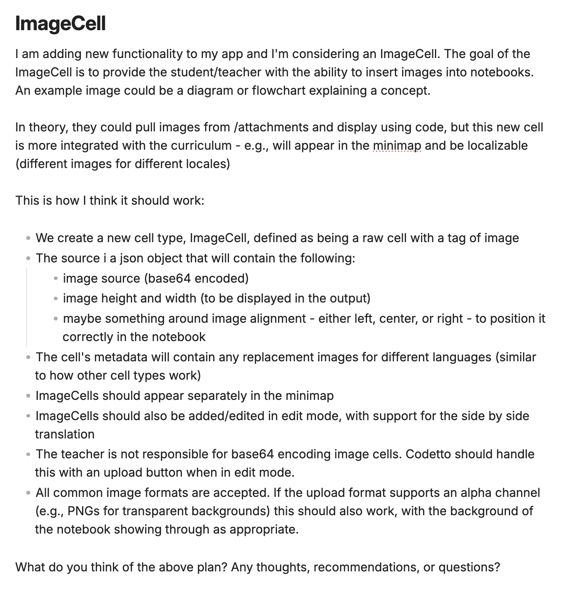
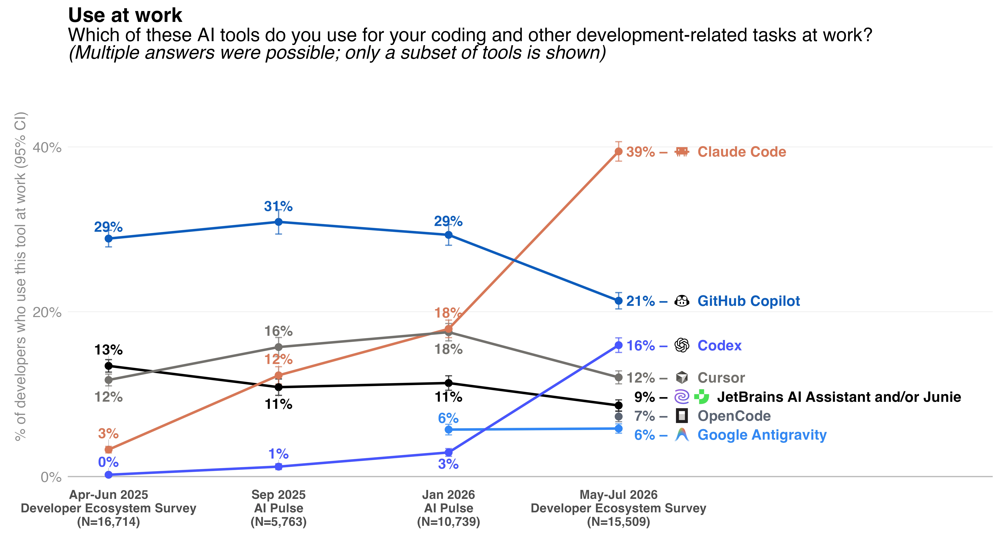
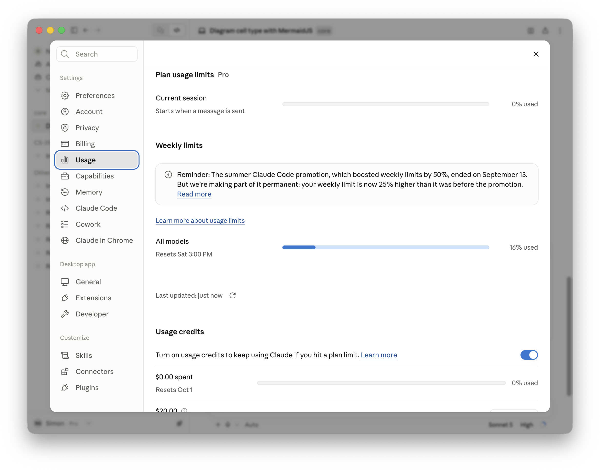

## Software transformation

- In the past 12 months, coding agents have transformed decades-old methods of writing software
- As of July 2026, **90% of professional developers are using coding agents weekly** (source: JetBrains Dev Ecosystem survey)
- **68% of them using agents daily**

## Software transformation

- Rapid acceleration of coding tools
- Claude Code used by 40% of developers (from 18% in Jan 2026)
- Codex used by 16% of developers (from 3% in Jan 2026)
- Claude Code creator, Boris Cherny, stated that 100% of his contributions to Claude Code are written by Claude Code
- 80% of code at Anthropic is written by Claude Code (as of May 2026)

## How did we get here?

- **2020 - GPT-3** (OpenAI): not trained specifically on code, but surprised researchers by generating coherent snippets
- **2021 - OpenAI Codex**: GPT-3 fine-tuned on 54M GitHub repos (~159GB of Python)
- **2021 - GitHub Copilot technical preview**: first public coding agent, powered by Codex

## How did we get here?

- While the models were trained on code, the developer experience was still basic:
  - Glorified auto-complete

## How did we get here?

{.lightbox}

## How did we get here?

- In addition...
  - Limited ability to ask questions about the codebase
  - Many context limit challenges
    - Trying to understand the whole of the repo in window was virtually impossible

## How did we get here?

- Two major developments in 2023+:
  - Context windows grew from 4k → 128k → 1M+ tokens
  - Models could reason across entire codebases
  - Introduction of the **coding harness** or now most commonly known, **coding agent**

## How did we get here?

- Early coding agents
  - Devin, Aider, Cursor
    - Agents that could read files, make edits, and run tests with limited human intervention
  - Showed promise on benchmarks (18% on SWE-Bench) but...
    - Explicit plan and work modes
    - Often one-shot suggestions that ran in a loop

## Today's coding agents

- Multi-step planners and reasoners
- Tool access (bash, web, python, etc.)
- Manage their context (through memory, skills, etc.)
- Manage their reasoning effort (model selection)
- Often delegate to multiple, background agents for tasks

## Using a coding agent

{.lightbox}

## Using a coding agent - CLI

{.lightbox}

## Using a coding agent - IDE

{.lightbox}

## Using a coding agent - Desktop

{.lightbox}

## Using a coding agent - Mobile

{.lightbox fig-align="center" width="300px"}

## Components of a coding agent

- `CLAUDE.md` (`AGENTS.md`)
  - Injected at the start of every conversation
  - Introduces the coding agent to your project/repo/architecture
  - Also used for style conventions/preferences
  - Can have multiple `CLAUDE.md`/`AGENTS.md` files in hierarchy
  - [Examples](https://agents.md/#examples){.external target="_blank"}

## Components of a coding agent

- `SKILL.md`
  - Separate skill file, loaded on-demand by the agent
  - Used for defining how specific features are developed
    - New web components for a site
    - How content should be translated/localized
  - Helps reduce the size of `CLAUDE.md`/`AGENTS.md`

# Demo

Using Claude Code to build a simple todo app

## "Vibe coding"

- Coined by AI researcher Andrej Karpathy in early 2025
- *"fully gives into the vibes"*
- Focuses on the creative direction and outcomes vs. the individual lines of syntax

## "Vibe coding"

- Can be tempting:
  - Create an issue in GitHub, send a coding agent to work on it, monitor it from your mobile phone
  - **But,** you lose control of the architecture
  - *"Don't let AI build faster than you are capable of understanding"*
    - https://blog.ploeh.dk/2026/09/16/on-learning-programming-in-an-age-of-llms/
  - Analogy to the Winchester Mystery House

## "Vibe coding"

{.lightbox fig-align="center" width="800px"}

## Agents as "power tools"

- I prefer "power tool" approach:
  - Own the architecture / frame out the house
  - Carefully hand-build / build the frame
  - Then use AI to fill in the details for each room

## Agents as "power tools"

{.lightbox fig-align="center"}

## Agents as "power tools"

- Mapping this to Claude Code
  - `CLAUDE.md` should describe the architecture of the system (analogy: house frame)
  - `SKILL.md` should describe each area that Claude can contribute to (analogy: working on each room)

## Introducing my lifecycle

- I've been writing software for 25+ years
- Shipped multiple products at Microsoft, IBM, SAP, Amazon, Code.org, and others
- Today, Claude is writing close to 100% of my code
  - In many ways, that's really scary!
- Many professional developers are still working out the best way to work with coding agents
  - I've found the following lifecycle works (for me)

## Introducing my lifecycle

- **Plan** - plan a feature
- **Act** - build the feature
- **Test** - test the feature
- **Abort** - abort the session if needed
- **Review** - carefully review what changed
- **Commit** - commit to source control
- **Clear** - clear the current conversation

## Introducing my lifecycle

- **Plan**
  - Start by writing the specification for the feature
  - Separate mark down file, descriptive, bullet points help
  - Ask the agent to validate/question the approach
  - *"What questions and/or clarifications do you have?"*
  - Push back on things that seem incorrect

## Introducing my lifecycle

{.lightbox fig-align="center" width="500px"}

## Introducing my lifecycle

- **Act**
  - Once happy with the specification, ask Claude to implement
  - Watch carefully for file changes/updates
  - Correct approach mid-stream
  - *"One minute - I think there's a 3rd party library for that..."*

## Introducing my lifecycle

- **Test**
  - Test the feature locally / manually
  - Build a complete test suite - I would recommend Playwright
  - (Agents are really good at writing tests)
  - Have the agent run it's own tests after the feature (you can specify this into the `CLAUDE.md` file)

# Demo

Test suite example

## Introducing my lifecycle

- **Abort**
  - Sometimes, things don't work as expected!
  - It can be challenging to fix before exhausting the context window
  - And often coding agents will "spin out of control"
  - `git stash`, clear context (new session), update the feature spec, and restart

## Introducing my lifecycle

- **Review**
  - What did the agent generate?
  - Are the tests well written / did it run the test suite?
  - Does `CLAUDE.md` need to be updated? Any new skills to create from this feature?
  - Auto-compact if approaching ~100K (hard limit at 150K)

## Introducing my lifecycle

- **Commit**
  - I choose what to commit and when!
  - (I give access to the `git` command line for history access, but forbid the agent permission to commit on my behalf)

## Introducing my lifecycle

- **Clear**
  - Once `CLAUDE.md` and feature is committed, clear context (`/new` in Claude Code)
  - Analogy: 50 First Dates movie

## Introducing my lifecycle

{.lightbox fig-align="center" width="400px"}

## Other ways of using agents

- Ask for general guidance on an existing repo/architecture
- Writing tests for an existing repo (especially if you don't have any)
- Repetitive tasks that you need to do manually (e.g., image background generation)
- Configuration / infrastructure files (e.g., .gitignore)
- Synthetic data generation (e.g., sample json files)

## Coding agents anti-patterns

- Doing too much 
  - e.g., "I've created a README.md file for you"
- Wanting too much access
  - e.g., gating on tool usage / token cost / shutting down my dev server
- Fragile tests
  - e.g., creating tests that used production data which changed
- CSS
  - Much better now, but often CSS overhangs and misalignment

## Options and costs

- Many different agents. Most popular (in order):
  - **Claude Code**
  - **GitHub Copilot**
  - **OpenAI Codex**
  - **Cursor**
  - **JetBrains Junie**
  - **Google Antigravity**

## Options and costs

## Options and costs

- Monthly subscription 
  - Subs run between $20/mo - $200/mo
  - Daily/weekly max token limits
  - Option to "top up" if you go over

## Options and costs

{.lightbox fig-align="center" width="80%"}

## Options and costs

- Pay-as-you-go API
  - Either with developer account or via OpenRouter
  - No monthly commitment, but much higher costs
  - $20 -> ~$2K if tokens are managed well
  - OpenRouter does have much cheaper options
    - Sonnet 5 = $2/M input; $10/M output
    - Qwen 3.8 = $0.15/M input; $1.875/M output

## Options and costs

- "Tokenmaxxing" - org-based developer leaderboards
- Being frugal with tokens
  - Don't vibe code your app!
  - Choose models carefully (Sonnet vs. Opus vs. Fable)
  - Spread requests throughout the day
  - Limit access to testing tools (e.g., Chrome browser access)

## Can I run coding agents locally?

- Yes, albeit with many caveats:
  - You'll need a well-spec'd laptop
  - Token generation will be slower
  - Models have much smaller context windows
- Good for small, focused features
- Great for long-running, synthetic data generation
- Offline access with no API costs

## Can I run coding agents locally?

- **OpenCode** is an open-source, terminal-based AI coding agent
  - Runs entirely locally using any OpenAI-compatible API server (e.g., LM Studio)
  - Reads and edits files, runs shell commands, and iterates on code
- **Model-agnostic** Swap in any local model (Qwen, DeepSeek, Llama, etc.) via a config file

# Demo

OpenCode running with local model

## Using coding agents in CSP

- Our guidelines for using coding agents in CSP
  - Don't vibe code your project!
  - Remember the house frame analogy - you'll want to create this by hand first
  - If using a coding agent, we will require overview of usage (and conversation transcripts) at each milestone presentation
  - You/your team is responsible for costs

# Q&A

